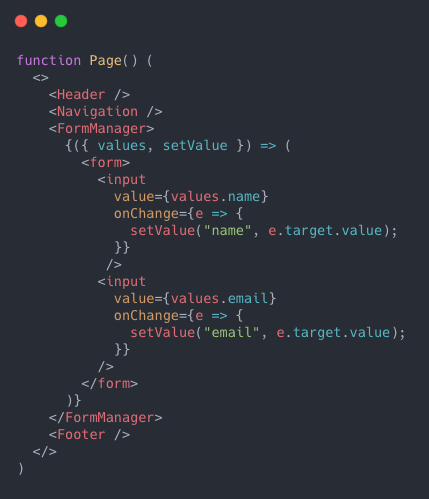
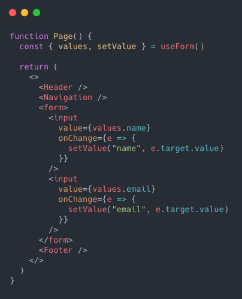

Can you guess which code snippet is more efficient and why?
<div style="display: inline-block; width: 322px; border-right: 1px solid #343842;">
  
</div>
<div style="display: inline-block; width: 303px;">
  
</div>

This [twitter discussion](https://twitter.com/moubi/status/1271429303574556672) started with the same question above recently. I wanted to know if people have strong opinion about hooks and render props.

A component with **render prop**:
 - is often **more flexible and efficient** than pure hooks solution when it comes to state management.
 - is still suitable for **the common** case.

The truth is, hooks and render props shake hands and play well together. If you must decide between the two, though, let's put that decision on stress.

Read on...

_If your are not familiar with hooks and the render props pattern - don't worry - a good starting point is [Render Props](https://reactjs.org/docs/render-props.html), [Use a Render Prop!](https://cdb.reacttraining.com/use-a-render-prop-50de598f11ce) and [Hooks at a Glance](https://reactjs.org/docs/hooks-overview.html) from the React docs. A list of resources is also available at the end._

## <a class="header-link" href="#render-props-are-not-dead" id="render-props-are-not-dead">#</a> Render Props are Not Dead

[A talk](https://www.youtube.com/watch?v=pn0pIgdQvhU&list=PLCC436JpVnK0Q4WHoB85ZYBwcCyTaMgAl&index=6) with that name by [Erik Rasmussen](https://twitter.com/erikras) was the trigger for this writing. It outlines how we got from HoCs to hooks. Watch it, it should make things clearer.

I remember the voice in my head when hit the play button on that React Europe video: _"Wait, should I do another rewrite of my library, getting rid of the render props I so much like"_. At that time **v2 of [Enform](https://github.com/moubi/enform)** was released and I was happy with it. V3 rewrite at that moment would destroy the positive feeling.

**May be you:**
 - work with hooks, but may not fully understand them
 - see hooks as a magic solution
 - want to rewrite it all with hooks

If so, then what follows may be a surprise.

## <a class="header-link" href="#the-problem" id="the-problem">#</a> The problem
Hooks and render props can solve the same problem. **It is conceptually about moving state away from your components, so that it is reusable.** Both render props or hooks can help you achieve that. The question is which one does better job? When? Does it matter bother with wrapper components and render props since we already have the hooks api?

Let's work with the common form example below throughout this journey. It's trivial and you have probably seen it many times:

```jsx
class Form extends Component {
  constructor(props) {
    super(props);

    this.state = {
      name: props.name || "",
      email: props.email || ""
    }
  }

  render() {
    return (
      <form>
        <input
          value={this.state.name}
          onChange={e => {
            this.setState({ name: e.target.value });
          }}
        />
        <input
          value={this.state.email}
          onChange={e => {
            this.setState({ email: e.target.value });
          }}
        />
      </form>
    );
  }
}
```
<p align="center">
<sup>The form is intentionally kept simpler.<sup>
</p>

The snippet may make you think: _"This is recipe for disaster"_. Right, and state is the primary suspect. Also, usually you have more fields involved in the picture and need to handle validation, submission, API calls, error messages. Of course, as a result **your component will grow. Then you would probably like to relief the state logic by abstracting it somehow.**

## <a class="header-link" href="#handling-state-abstraction-with-hooks" id="handling-state-abstraction-with-hooks">#</a> Handling state abstraction with hooks
Look at this simplified code:

```jsx
function Form() {
  const [name, setName] = useState("");
  const [email, setEmail] = useState("");

  return (
    <>
      <h1>This is a simple form!</h1>
      <form>
        <input
          value={name}
          onChange={e => {
            setName(e.target.value);
          }}
        />
        <input
          value={email}
          onChange={e => {
            setEmail(e.target.value);
          }}
        />
      </form>
    </>
  );
}
```

<p align="center">
<sup>Try it out in <a target="_blank" href="https://codesandbox.io/embed/controlled-form-with-hooks-1e9o7?expanddevtools=1&fontsize=14&hidenavigation=1&module=%2Fsrc%2FApp.js&theme=dark">codesandbox</a><sup>
</p>

It is the same form component, but using a function instead of class and the `useState` hook.  Simple move that already made things nicer. Adding more fields to this controlled form is as easy as handling more state to the component.

```jsx
const [name, setName] = useState("");
const [email, setEmail] = useState("");
const [phone, setPhone] = useState("");  // highlight-line
const [address, setAddress] = useState("");  // highlight-line
...
```

Using hooks and functional components is already a win. Great, but you bump into another trouble - component state is growing together with your form. Two options to address that further. Create separate component or custom hook with the state heavy lifting.

### <a class="header-link" href="#form-custom-hook" id="form-custom-hook">#</a> Form custom hook
I assume you know how to do that. There are many examples out there, so let's not focus on `useForm` implementation below. The interesting part is how it improves our component and how it gets used. Remember we are slowly getting to the pain point - would custom hook be the best approach in this case.

Lastly, please excuse once again the simplicity as the idea is just to illustrate the pattern.

```jsx
function Form() {
  const { values, setValue } = useForm();  // highlight-line

  return (
    <>
      <h1>This is a simple form!</h1>
      <form>
        <input
          value={values.name}
          onChange={e => {
            setValue("name", e.target.value);
          }}
        />
        <input
          value={values.email}
          onChange={e => {
            setValue("email", e.target.value);
          }}
        />
      </form>
    </>
  );
}
```
<p align="center">
<sup>Check the <a target="_blank" href="https://codesandbox.io/s/controlled-form-with-custom-hook-f810j?expanddevtools=1&fontsize=14&hidenavigation=1&module=%2Fsrc%2FApp.js&theme=dark">codesandbox</a> for details.

Ideally adding more logic would result in just the `jsx` (the render) part growing, while `useForm` manages the state for you.

_Side note:_
`useForm()` (it's a pretty common name) may miss-reference you to [react-hook-form](https://github.com/react-hook-form/react-hook-form). The name matches, but the idea is different. `react-hook-form` is not solving the state problem here, but avoiding it by having the form as uncontrolled instead.

Getting back to our example. Adding errors and submit features:
```jsx{2}
function Form() {
  const { values, setValue, errors, submit } = useForm();

  return (
    <>
      <h1>This is a simple form!</h1>
      <form onSubmit={submit}>
        <input
          value={values.name}
          onChange={e => {
            setValue("name", e.target.value);
          }}
        />
        <input
          value={values.email}
          onChange={e => {
            setValue("email", e.target.value);
          }}
        />
        <input
          value={values.phone}
          onChange={e => {
            setValue("phone", e.target.value);
          }}
        />
        <p>{errors.phone}</p>
      </form>
    </>
  );
}
```

Still, it scales pretty good. You can put more and more code into the hook and make it reusable for all form components in your project.

The state is extracted from `<Form />`, but the component will continue to react on field  changes. At the end, it is the same `useState` usage, but moved in `useForm`.

**The obvious benefits of this approach are that it is very intuitive (no weird syntax), scales pretty well and it's probably part of the React future.**

Ok, but how about render props?

## <a class="header-link" href="#handling-state-via-render-prop" id="handling-state-via-render-prop">#</a> Handling state via render prop
Unloading the Form component state-wise using the render props approach requires you to use a wrapper component. So, no hooks on the surface, but a regular component. In this example it is `children` that serves as a render prop, but you may use `render` (or something else) instead.

```jsx{5,6}
function Form() {
  return (
    <>
      <h1>This is a simple form!</h1>
      <FormManager>
        {({ values, setValue }) => (
          <form>
            <input
              value={values.name}
              onChange={e => {
                setValue("name", e.target.value);
              }}
            />
            <input
              value={values.email}
              onChange={e => {
                setValue("email", e.target.value);
              }}
            />
          </form>
        )}
      </FormManager>
    </>
  );
}
```
<p align="center">
<sup>Want to try it out or curious about <code class="language-text">FormManager</code>'s implementation? Here is the <a target="_blank" href="https://codesandbox.io/s/controlled-form-with-render-props-xvil0?expanddevtools=1&fontsize=14&hidenavigation=1&module=%2Fsrc%2FApp.js&theme=dark">codesandbox</a>.<sup>
</p>

Abstracting the state away in a weird way, right? Yes, this is how it is.

From the official docs:
>The term “render prop” refers to a technique for sharing code between React components using a prop whose value is a function.

**_"...using a prop whose value is a function"_** - that's what seems awkward when you use render props for first time. Other than that it works similar to `useForm` except `<FormManager />` is a component.

This pattern might be familiar, especially if you are working on third party libraries or using such, which is the case with many of us. I'll skip revealing the logic behind `<FormManager />`, but if you are interested ref the codesandbox above.

**The render props approach has similar benefits to hooks, but looks strange and sometimes doesn't scale efficiently.** Why?

Imagine you have something like that:

```jsx{7,10,12,14}
function MyComponent() {
  return (
    <Swipeable
      onSwipeLeft={handleSwipeLeft}
      onSwipeRight={handleSwipeRight}
    >
      {innerRef => (
        <div ref={innerRef}>
          <DragDropContext onDragEnd={handleDragEnd}>
            {() => (
              <Droppable>
                {() => (
                  <Draggable>
                    {provided => (
                      <div
                        ref={provided.innerRef}
                        {...provided}
                      />
                    )}
                  </Draggable>
                )}
              </Droppable>
            )}
          </DragDropContext>
        </div>
      )}
    </Swipeable>
  );
}
```
<p align="center">
<sup>That is actually a real example.<sup>
</p>

Nested wrapper components with render props. Oh, that doesn't look very promising. It tricks some people to believe the pattern is obsolete in favour of _"do everything with hooks"_. Hooks [doesn't suffer the nesting issue](https://reactjs.org/docs/hooks-faq.html#do-hooks-replace-render-props-and-higher-order-components), that's true.

If render props had no pros over hooks the article is leading to a dead end. But it's not, I promise. There is something else, though, which is not about the syntax. Keep on...

## <a class="header-link" href="#reality-check" id="reality-check">#</a> Reality check
Let's recap. Remember this part from our example?

```jsx{2}
<>
  <h1>This is a simple form!</h1>
  <form>
    ...
  </form>
</>
```

I intentionally left more elements (`<h1 />`) than just a `<form />` in the jsx. It is suppose to serve as a hint, because **in reality some components aren't that simple**. Often they render other components or third party ones which you don't have control over.

A more realistic example would look like so:

```jsx{6,7,8,23}
function Page() {
  const { values, setValue } = useForm();

  return (
    <>
      <Header />
      <Navigation />
      <SomeOtherThirdPartyComponent />
      <form>
        <input
          value={values.name}
          onChange={e => {
            setValue("name", e.target.value);
          }}
        />
        <input
          value={values.email}
          onChange={e => {
            setValue("email", e.target.value);
          }}
        />
      </form>
      <Footer />
    </>
  );
}
```

Now, I know you may say: _who uses jsx like that? You can obviously extract the form logic into another component and render it here instead_. Yes and you would be right - seems it is the right thing to do, but not always.

There are three general restrictions with hooks:
 1. you need react@16.8.0 (the one with hooks)
 2. you have to use functional components
 3. **you may fall into re-render issues**

Skipping the first two... If you have class components and lower version of react you can't use hooks obviously. **The third one, though, is the cornerstone when deciding between hooks and render props.**

### <a class="header-link" href="#you-may-fall-into-re-render-issues" id="you-may-fall-into-re-render-issues">#</a> You may fall into re-render issues
Given the last example, every time you type in the form fields `setValue` will be called causing the whole `<Page />` component to re-render. Yes, because you are updating the state, this is expected. But not desirable. **Suddenly filling a form with data becomes very expensive operation.** React is clever enough to protect you from unnecessary renders, but it won't go against its principles. Every  component has its own catch-ups and you need to work around these, so it's safe against renders.

So, you don't have many options here. **Extracting the from in a separate component is the way to go with hooks**. As a consequence - you will need to **repeat that for every form** in your project making the tree grow inevitably.

What if you are building an OSS library that exports a hook like `useForm`? Do you prefer your users to do the extra extraction step above? Not a big deal you may say. Not a big one, but a less flexible one.

Hooks are not remedy for all problems and they are not intended to serve as such. The hypothetic (or not) primer I shared is one of these cases where you may need the extra flexibility.

Use the hooks, but add some sugar.

### <a class="header-link" href="#re-render-only-what-is-relevant" id="re-render-only-what-is-relevant">#</a> Re-render only what is relevant
Render props doesn't suffer the same re-render issue hooks do. Here is why.

```jsx{7,8}
function Page() {
  return (
    <>
      <Header />
      <Navigation />
      <SomeOtherThirdPartyComponent />
      <FormManager>
        {({ values, setValue }) => (
          <form>
            <input
              value={values.name}
              onChange={e => {
                setValue("name", e.target.value);
              }}
            />
            <input
              value={values.email}
              onChange={e => {
                setValue("email", e.target.value);
              }}
            />
          </form>
        )}
      </FormManager>
      <Footer />
    </>
  );
}
```

**`<FormManager />` ensures whatever change is made in the form it will be isolated in that form.** `<Page />` is immune to unnecessary renders. You can add up more jsx with no side effects.

Of course you can always break the useful pattern. Imagine updating some `<Page />` related state as a result of form manipulation. It will result in additional renders. But then, it will be your fault.

Now if your OSS library instead exports component with a render prop you are giving your users the extra flexibility. They can consume it directly without being forced to create additional components.

## <a class="header-link" href="#final-words" id="final-words">#</a> Final words
**Render props are very useful if you want to isolate part of the jsx and inject some state without introducing side effects to your component.**

It is common that many render prop implementations are using hooks internally so saying _"it's hooks or nothing"_ would be extreme. Hooks support the pattern pretty well and gain the extra flexibility they lack in some situations. This is to consider when deciding between one OR the other approach.

But hey, your OSS library can export both - the wrapper component and the hook. That makes working on open source so fun. You have greater control.

What is your answer on the two photos at the top?

## Resources
The list here is not extensive. Some of the topics are more advanced, some are touching just the basics. **You are welcome to add to it.**

 - [Render Props](https://reactjs.org/docs/render-props.html) (React docs)
 - [Hooks at a Glance](https://reactjs.org/docs/hooks-overview.html) (React docs)
 - [Render Props are Not Dead](https://www.youtube.com/watch?v=pn0pIgdQvhU&list=PLCC436JpVnK0Q4WHoB85ZYBwcCyTaMgAl&index=6) (Erik Rasmussen)
 - [Use a Render Prop!](https://cdb.reacttraining.com/use-a-render-prop-50de598f11ce) (Michael Jackson)
 - [Awesome React Render Props](https://github.com/jaredpalmer/awesome-react-render-props) (Jared Palmer)
