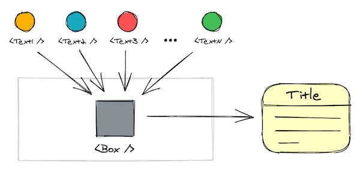

<!-- <p>
  
</p> -->

examples
flexbox
layouts
alignment
easy
flex
fluid
responsive
reference
common

responsive flexbox columns
responsive flexbox rows
flexbox demo
flexbox layout demo
css flex layout demo
___

Flexbox is still the preferred way for building web page layouts (https://almanac.httparchive.org/en/2020/css#flexbox-and-grid-adoption) and is about to stay on top for quite some time.

Searching for "flexbox cheat-sheet" in Google brings so many useful and complete guides we reference on a daily basis but when it comes to specific non-trivial use cases our search takes longer. Sometimes you end up experimenting until the things workout.

**The guide below is not complete but does include some common flexbox layouts usually not covered in most how-tos. It is also simple enough so you can just copy-paste the code in your projects.**

## Table of Contents
<div class="table-of-contents">
  <a href="#">
    <span>Flexbox cards on a touch device</span>
    <div class="parent1 box">
      <div></div>
      <div></div>
      <div></div>
    </div>
  </a>

  <a href="#">
    <span>Cards with equal height despite content</span>
    <div class="parent2 box">
      <div></div>
      <div></div>
      <div></div>
    </div>
  </a>

  <a href="#">
    <span>Cards with height based on content</span>
    <div class="parent3 box">
      <div></div>
      <div></div>
      <div></div>
    </div>
  </a>

  <a href="#">
    <span>A fixed and a fluid flexbox card based on content</span>
    <div class="parent4 box">
      <div></div>
      <div></div>
    </div>
  </a>

  <a href="#">
    <span>Vertically centered cards</span>
    <div class="parent9 box">
      <div></div>
      <div></div>
    </div>
  </a>

  <a href="#">
    <span>Plans and prices cards</span>
    <div class="parent5 box">
      <div></div>
      <div></div>
      <div></div>
    </div>
  </a>

  <a href="#">
    <span>Three column layout with two sidebars</span>
    <div class="parent6 box">
      <div></div>
      <div></div>
      <div></div>
    </div>
  </a>

  <a href="#">
    <span>Three row layout with Header, Content, and Footer</span>
    <div class="parent7 box">
      <div></div>
      <div></div>
      <div></div>
    </div>
  </a>

  <a href="#">
    <span>Three row layout with Header, Footer, Sidebar, and Content</span>
    <div class="parent8 box">
      <div class="child"></div>
      <div class="main">
        <div class="child"></div>
        <div class="child content"></div>
      </div>
      <div class="child"></div>
    </div>
  </a>
</div>

## Basic HTML structure

```html
<div class="parent">
  <div class="child">...</div>
  <div class="child">...</div>
  <div class="child">...</div>
  ...
</div>
```

## Flexbox Cards on a Touch Device

<iframe height="485" style="width: 100%;" scrolling="no" title="Drop Last Item Full Width" src="https://codepen.io/moubi/embed/YzpZpVM?height=485&theme-id=dark&default-tab=result" frameborder="no" loading="lazy" allowtransparency="true" allowfullscreen="true">
  See the Pen <a href='https://codepen.io/moubi/pen/YzpZpVM'>Drop Last Item Full Width</a> by Miroslav Nikolov
  (<a href='https://codepen.io/moubi'>@moubi</a>) on <a href='https://codepen.io'>CodePen</a>.
</iframe>

<details open>
<summary>CSS Code</summary>

```css
.parent {
  display: flex;
  justify-content: space-between;
  flex-wrap: wrap;
}

.child {
  flex-grow: 1;
}

.child:last-child {
  width: 100%;
}
```
</details>

<details>
<summary>HTML structure (<i>click to open</i>)</summary>

```html
<div class="parent">
  <div class="child">1</div>
  <div class="child">2</div>
  <div class="child">3</div>
</div>
```
</details>


## Cards with Equal Height Despite Content

<iframe height="435" style="width: 100%;" scrolling="no" title="Same Height, Same Width" src="https://codepen.io/moubi/embed/dyOvWgE?height=435&theme-id=dark&default-tab=result" frameborder="no" loading="lazy" allowtransparency="true" allowfullscreen="true">
  See the Pen <a href='https://codepen.io/moubi/pen/dyOvWgE'>Same Height, Same Width</a> by Miroslav Nikolov
  (<a href='https://codepen.io/moubi'>@moubi</a>) on <a href='https://codepen.io'>CodePen</a>.
</iframe>

<details open>
<summary>CSS Code</summary>

```css
.parent {
  display: flex;
  justify-content: space-between;
}

.child {
  flex-grow: 1;
  flex-basis: 0;
}
```
</details>

<details>
<summary>HTML structure (<i>click to open</i>)</summary>

```html
<div class="parent">
  <div class="child">
    It is a long established fact that a reader will be distracted by the readable content of a page when looking at its layout.
  </div>
  <div class="child">Contrary to popular belief, Lorem Ipsum is not simply random text.</div>
  <div class="child">
    Lorem Ipsum is simply dummy text of the printing and typesetting industry.
  </div>
</div>
```
</details>

## Cards with Height Based on Content

<iframe height="435" style="width: 100%;" scrolling="no" title="Flexbox Children with Auto Height" src="https://codepen.io/moubi/embed/poNPKpE?height=435&theme-id=dark&default-tab=result" frameborder="no" loading="lazy" allowtransparency="true" allowfullscreen="true">
  See the Pen <a href='https://codepen.io/moubi/pen/poNPKpE'>Flexbox Children with Auto Height</a> by Miroslav Nikolov
  (<a href='https://codepen.io/moubi'>@moubi</a>) on <a href='https://codepen.io'>CodePen</a>.
</iframe>

<details open>
<summary>CSS Code</summary>

```css
.parent {
  display: flex;
  align-items: flex-start;
}

.child {
  flex-grow: 1;
  flex-basis: 0;
}
```
</details>

<details>
<summary>HTML structure (<i>click to open</i>)</summary>

```html
<div class="parent">
  <div class="child">
    It is a long established fact that a reader will be distracted by the readable content of a page when looking at its layout.
  </div>
  <div class="child">Contrary to popular belief, Lorem Ipsum is not simply random text.</div>
  <div class="child">Lorem Ipsum is simply dummy text.</div>
</div>
```
</details>

## A Fixed and a Fluid Flexbox Card Based on Content

<iframe height="295" style="width: 100%;" scrolling="no" title="Flexbox Child with No Shrink" src="https://codepen.io/moubi/embed/OJbpgpg?height=295&theme-id=dark&default-tab=result" frameborder="no" loading="lazy" allowtransparency="true" allowfullscreen="true">
  See the Pen <a href='https://codepen.io/moubi/pen/OJbpgpg'>Flexbox Child with No Shrink</a> by Miroslav Nikolov
  (<a href='https://codepen.io/moubi'>@moubi</a>) on <a href='https://codepen.io'>CodePen</a>.
</iframe>

<details open>
<summary>CSS Code</summary>

```css
.parent {
  display: flex;
}

.child:last-child {
  flex-shrink: 0;
}
```
</details>

<details>
<summary>HTML structure (<i>click to open</i>)</summary>

```html
<div class="parent">
  <div class="child">1</div>
  <div class="child">Lorem Ipsum is simply dummy print text.</div>
</div>
```
</details>

## Vertically centered cards

<iframe height="500" style="width: 100%;" scrolling="no" title="Flexbox Centered Items" src="https://codepen.io/moubi/embed/bGBvZmj?height=500&theme-id=dark&default-tab=result" frameborder="no" loading="lazy" allowtransparency="true" allowfullscreen="true">
  See the Pen <a href='https://codepen.io/moubi/pen/bGBvZmj'>Flexbox Centered Items</a> by Miroslav Nikolov
  (<a href='https://codepen.io/moubi'>@moubi</a>) on <a href='https://codepen.io'>CodePen</a>.
</iframe>

<details open>
<summary>CSS Code</summary>

```css
.parent {
  display: flex;
  align-items: center;
  justify-content: center;
  flex-direction: column;
}
```
</details>

<details>
<summary>HTML structure (<i>click to open</i>)</summary>

```html
<div class="parent">
  <div class="child">1</div>
  <div class="child">2</div>
</div>
```
</details>

## Plans and Prices Cards

<iframe height="500" style="width: 100%;" scrolling="no" title="Flexbox Item Full Height" src="https://codepen.io/moubi/embed/yLVvXPm?height=500&theme-id=dark&default-tab=result" frameborder="no" loading="lazy" allowtransparency="true" allowfullscreen="true">
  See the Pen <a href='https://codepen.io/moubi/pen/yLVvXPm'>Flexbox Item Full Height</a> by Miroslav Nikolov
  (<a href='https://codepen.io/moubi'>@moubi</a>) on <a href='https://codepen.io'>CodePen</a>.
</iframe>

<details open>
<summary>CSS Code</summary>

```css
.parent {
  display: flex;
  align-items: center;
  height: 100vh;
}

.child {
  flex-grow: 1;
}

.child:nth-child(2) {
  align-self: stretch;
}
```
</details>

<details>
<summary>HTML structure (<i>click to open</i>)</summary>

```html
<div class="parent">
  <div class="child">1</div>
  <div class="child">2</div>
  <div class="child">3</div>
</div>
```
</details>

## Three column layout with two sidebars

<iframe height="400" style="width: 100%;" scrolling="no" title="Flexbox Middle Item Stretch" src="https://codepen.io/moubi/embed/dyOmaow?height=400&theme-id=dark&default-tab=result" frameborder="no" loading="lazy" allowtransparency="true" allowfullscreen="true">
  See the Pen <a href='https://codepen.io/moubi/pen/dyOmaow'>Flexbox Middle Item Stretch</a> by Miroslav Nikolov
  (<a href='https://codepen.io/moubi'>@moubi</a>) on <a href='https://codepen.io'>CodePen</a>.
</iframe>

<details open>
<summary>CSS Code</summary>

```css
.parent {
  display: flex;
}

.child {
  flex-basis: 0;
}

.child:nth-child(2) {
  flex-grow: 1;
}
```
</details>

<details>
<summary>HTML structure (<i>click to open</i>)</summary>

```html
<div class="parent">
  <div class="child">1</div>
  <div class="child">2</div>
  <div class="child">3</div>
</div>
```
</details>

## Three row layout with Header, Content, and Footer

<iframe height="600" style="width: 100%;" scrolling="no" title="Flexbox Header, Body, Footer" src="https://codepen.io/moubi/embed/oNYEGGv?height=600&theme-id=dark&default-tab=result" frameborder="no" loading="lazy" allowtransparency="true" allowfullscreen="true">
  See the Pen <a href='https://codepen.io/moubi/pen/oNYEGGv'>Flexbox Header, Body, Footer</a> by Miroslav Nikolov
  (<a href='https://codepen.io/moubi'>@moubi</a>) on <a href='https://codepen.io'>CodePen</a>.
</iframe>

<details open>
<summary>CSS Code</summary>

```css
.parent {
  display: flex;
  flex-direction: column;
  height: 100vh;
}

.child:nth-child(2) {
  flex-grow: 1;
}
```
</details>

<details>
<summary>HTML structure (<i>click to open</i>)</summary>

```html
<div class="parent">
  <div class="child">Header</div>
  <div class="child">Content</div>
  <div class="child">Footer</div>
</div>
```
</details>

## Three row layout with Header, Footer, Sidebar, and Content

<iframe height="600" style="width: 100%;" scrolling="no" title="Flexbox Header, Sidebar, Content, Footer" src="https://codepen.io/moubi/embed/OJbQxGx?height=600&theme-id=dark&default-tab=result" frameborder="no" loading="lazy" allowtransparency="true" allowfullscreen="true">
  See the Pen <a href='https://codepen.io/moubi/pen/OJbQxGx'>Flexbox Header, Sidebar, Content, Footer</a> by Miroslav Nikolov
  (<a href='https://codepen.io/moubi'>@moubi</a>) on <a href='https://codepen.io'>CodePen</a>.
</iframe>

<details open>
<summary>CSS Code</summary>

```css
.parent {
  display: flex;
  flex-direction: column;
  height: 100vh;
}

.main {
  display: flex;
  flex-grow: 1;
}

.content {
  flex-grow: 1;
}
```
</details>

<details>
<summary>HTML structure (<i>click to open</i>)</summary>

```html
<div class="parent">
  <div class="child">Header</div>
  <div class="main">
    <div class="child">Sidebar</div>
    <div class="child content">Content</div>
  </div>
  <div class="child">Footer</div>
</div>
```
</details>

## Final Words
Handling text components may look simple on the surface, but in some situations requires you to take a different approach and the extra step.

If a component doesn't change its visual representation and structure but may have many content variants, it makes sense to involve fewer wrappers if possible. The guiding principle is to avoid being smart about code reusability. Instead, go **explicit and minimal** expecting things to change.

<style loading="lazy">
  .table-of-contents {
    display: flex;
    justify-content: space-between;
    flex-wrap: wrap;
  }

  .table-of-contents a {
    position: relative;
    width: 140px;
    height: 140px;
    padding: 5px;
    margin-bottom: 20px;
    text-align: center;
    text-decoration: none;
    box-shadow: none;
    background-color: #21242a;
    border-radius: 7px;
    transform: translateY(0);
    transition: transform 0.3s;
  }

  .table-of-contents a:hover {
    transform: translateY(-7px);
    transition: transform 0.3s;
  }

  .table-of-contents a:hover span {
    visibility: visible;
    opacity: 1;
    transition: opacity 0.3s;
  }

  .table-of-contents a span {
    display: flex;
    visibility: hidden;
    position: absolute;
    top: 0;
    left: 0;
    height: 100%;
    align-items: center;
    justify-content: center;
    font-weight: 600;
    background-color: #282c35aa;
    color: #fff;
    opacity: 0;
    font-family: var(--secondaryFontFamily);
    font-size: 16px;
    z-index: 1;
  }

  .box {
    display: flex;
    width: 100%;
    height: 100%;
  }

  .box > div,
  .box .child {
    margin: 5px;
    background-color: #eab768;
    border-radius: 5px;
  }

  .parent1 {
    justify-content: space-between;
    flex-wrap: wrap;
  }

  .parent1 > div {
    flex-grow: 1;
  }

  .parent1 > div:last-child {
    width: 100%;
  }

  .parent2 {
    justify-content: space-between;
  }
  .parent2 > div {
    flex-grow: 1;
    flex-basis: 0;
  }

  .parent3 {
    align-items: flex-start;
  }
  .parent3 > div {
    flex-grow: 1;
  }
  .parent3 > div:nth-child(1) {
    height: 80%;
  }
  .parent3 > div:nth-child(2) {
    height: 60%;
  }
  .parent3 > div:nth-child(3) {
    height: 30%;
  }

  .parent4 > div {
    height: 30%;
    flex-grow: 1;
  }
  .parent4 > div:last-child {
    flex-grow: 2;
  }

  .parent5 {
    align-items: center;
  }
  .parent5 > div {
    flex-grow: 1;
    height: 40%;
  }
  .parent5 > div:nth-child(2) {
    height: 70%;
  }

  .parent6 > div {
    flex-basis: 0;
    flex-grow: 1;
  }
  .parent6 > div:nth-child(2) {
    flex-grow: 4;
  }

  .parent7 {
    flex-direction: column;
  }
  .parent7 > div {
    flex-basis: 0;
    flex-grow: 1;
  }
  .parent7 > div:nth-child(2) {
    flex-grow: 4;
  }

  .parent8 {
    flex-direction: column;
  }
  .parent8 > div {
    flex-grow: 1;
  }
  .parent8 .main {
    display: flex;
    flex-grow: 4;
    margin: 0;
    background-color: transparent;
    border-radius: 0;
  }
  .parent8 .main .child:first-child {
    flex-grow: 1;
  }
  .parent8 .content {
    flex-grow: 4;
  }

  .parent9 {
    align-items: center;
    justify-content: center;
    flex-direction: column;
  }
  .parent9 > div {
    height: 25%;
    width: 40%;
  }
</style>
