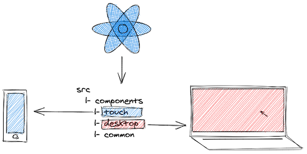

<p>
  
</p>

This article is a mix of arguments, reality checks and a code solution at the end. **Its focus: device (touch/desktop) driven code split in React with no backend.**

Often the road leading to an actual implementation is long and bumpy - priorities, design, budget, colleagues with their own views, talking in different languages. These obstacles are challenging and usually take more energy to deal with than just coding. For that reason they deserve a separate preface here.

Jump to the [code section](#conditionally-import-and-render-components), if this is what you are looking for, otherwise let's continue.

_It would be helpful if you already know what code splitting is. If not yet, the ["Code Splitting"](https://reactjs.org/docs/code-splitting.html#code-splitting) writeup in the React docs is a good start._
___

## Reality Check
**Many companies today prefer to build their web apps/sites targeting both touch and desktop devices, but would rather not invest in a separate mobile app.**

Chiefs may not admit it, but the reasons spin around:
 1. Building for the browser is fast and cheap.
 2. No need to involve the backend.
 3. Prizing "mobile first", but don't really align with that principle.
 4. Technical impediments to deliver a mobile app to the store.
 5. No budget.

Working in the browser is fast and reliable. There are many static site generators ([Gatsby](https://www.gatsbyjs.org/), [Nextjs](https://nextjs.org/), [Docusaurus](https://v2.docusaurus.io/)) to support website creation with no backend knowledge required. [Jamstack](https://jamstack.org/what-is-jamstack/) principles and tools make production deployments of a product easier than ever. Such tools are capable of bringing the "mobile first" concept to life, though it still remains wishful thinking.

At the same time publishing a standalone mobile app to some app stores may turn into a nightmare. Read about [the Hey saga](https://hey.com/apple/) fx. In contrast, javascript devs can quickly mockup a mobile version with the help of Chrome tools, so why hire an iOS/Android guy?

All valid points and to add more, often you as a frontend professional won't get the chance to influence the final decision (especially in big companies). It is to be taken by product, marketing or finance teams.

Native app or web app... Let's assume a decision is taken and you are left with no choice - **a web app must be delivered (for desktop and mobile users)**.

## If You Must Code Split
Splitting react apps touch/desktop wise can be tricky if you have to do it in the frontend.

Things to be considered:

 - 1️⃣ account for touch and desktop devices (**when** to serve each app)
 - 2️⃣ decide on the split starting point (**where** in the code)
 - 3️⃣ import only app specific components (**how** to implement it)

**An answer to these three questions is important since maintainability, time, team motivation and other aspects very much depend on it.**

## When a Device Is Considered Touch 1️⃣
Usually you modify component's css to account for mobile devices.

Perhaps the following

```css{8}
.TopBar {
  height: 60px;
  background-color: #fff;
  ...
}

/* Mobile */
@media (max-width: 768px) {
  .TopBar {
    height: 100px;
    background-color: #ccc;
    ...
  }
}
```

works well for you most of the time. Same component, but with different appearance based on browser's width. There is no problem with this approach and very often it is enough. Now one may argue that `max-width: 768px` is sufficient to properly tell if a user is on a mobile device. Probably not. May be something like that is more accurate:

```css
@media (pointer: coarse) and (hover: none) {
  ...
}
```
**You can read more about [interaction media features and their potential](https://css-tricks.com/interaction-media-features-and-their-potential-for-incorrect-assumptions/) to determine device capabilities.** Consider it when deciding on the criteria for serving your mobile web app.
___

Challenges arise when your company starts getting more serious about mobile users ("mobile first"). This could happen due to a separate strong design/UX and product teams being formed. **In this reality your desktop and mobile websites/apps may end up drastically different. Business logic, pages, interactions and overall appearance are now unalike. Two independent versions of the same software.**

How does that translate in the React's language?

For sure you won't be able to reuse every single component in both apps (touch and desktop). Same components/pages will require different data set and behave non-identically (javascript logic). Others will be completely unique per app. **In that case css adjustments as the one above may no longer be sufficient.** Interactions and data (javascript) need to be considered along with styling (css).

**This is where a proper split in the frontend must be done and it can't reside in your `.css` files alone.**

## Where to Split the App 2️⃣
It really depends. You have a few options considering requirements and design. **One** is to split the app in its root. Maybe you have `PageRouter.js` or just `App.js` where page components are rendered based on the URL path. **Second option** - split individual components. It is a good choice if pages for mobile and desktop are the same (or very similar), but some child components differ. You can also pick the **third option** of using media queries in the css.

### Split in the App's Root
**This approach makes sense if your mobile and desktop apps are very different - separate pages, behavior, data and business logic in components.**

Let's say there is a product details page (`<ProductDetails />`) on touch which doesn't exist in your desktop site. It displays detailed product information that otherwise would be part of `<Products />` when viewing on PC. On a phone, though, it might be too "noisy" to present so much data in a single page.

```python{3,6}
-- src
   |-- components
   |-- pages
   |   |-- touch
   |   |   |-- Products.js
   |   |   |-- ProductDetails.js
   |   |-- desktop
   |   |   |-- Products.js
   |   |-- common
   |       |-- Checkout.js
   |-- App.js
```
<p align="center">
<sup>See a <a target="_blank" href="https://codesandbox.io/s/desktopmobile-code-split-sjbt0?file=/src/pages/touch/ProductDetails.js">working example</a> in Codesandbox.</sup>
</p>

**Why is this structure OK?**
 - More control

You can look at `/touch` and `/desktop` folders as two separate apps, allowing for full control over their content.

 - Easier maintenance

Most pages in your app will be common - same names component-wise, but implementing app specific logic, which is great for maintenance.

 - Bug fixing in isolation

Having a bug in the products page on touch tells you that the cause is probably in `touch/Products.js`. Fixing it there ensures your desktop page won't be affected.

 - Less side effects

Few more buttons for mobile or a dropdown on desktop? You can feel more comfortable implementing feature requests like that next time.

 - Adequate team collaboration

Implementing a products page means you have to do it for each app (two components). With the folder split above, it's easy to divide the work within the team without stepping on each other's toes.

### Split on Component Level
Root level code split is often supplemented by splitting the `/components` folder in a similar way. On the other hand, sometimes your desktop and mobile apps won't be very different. Only a few components deep in the tree may have an unalike data model or behavior. **If you find yourself in any of these cases it might be useful to do a split per component**.

```python{2,3,6,9}
-- src
   |-- components
   |   |-- touch
   |   |   |-- TopBar.js
   |   |   |-- TopBar.css
   |   |-- desktop
   |   |   |-- TopBar.js
   |   |   |-- TopBar.css
   |   |-- common
   |       |-- Footer.js
   |       |-- Footer.css
   |-- pages
   |-- App.js
```

`<TopBar />` component has some data/behavior differences that require you to implement it separately for each app. In the same time `/common` folder still contains all shared components.

You can see how that id done for `/components` in [products page example](https://codesandbox.io/s/desktopmobile-code-split-sjbt0?file=/src/components/touch/Product.js).

**Why is this structure OK?**

Adding to the pros of the previous section **you will have less code to maintain**, since only a few components may require a split. Reusing app specific and shared components is also going to be straightforward.

```javascript{1}
import ProductDescription from "../../components/desktop/ProductDescription";

export default function Products() {
  ...
}
```
<p align="center">
<sup><code class="language-text">pages/desktop/Products</code> imports only components from <code class="language-text">components/desktop</code>.</sup>
</p>

### Components with Styling Differences
Should you create two copies of a component if it contains the same logic, but differs in styling? Looks like it should be shared and placed in the `/common` folder, but at the same time its css will need the good old media query approach.

```css
@media (max-width: 768px) { ... }

/* OR */

@media (pointer: coarse) and (hover: none) { ... }
```

That looks ok. Is it the best thing you can do, though? **What if the logic detecting mobile capabilities changes?** Should you change it everywhere? This is not optimal.

Ok, what to do?

Ideally the logic for detecting touch devices should be central for the app. Getting a desktop or mobile component to render should be a matter of simply tweaking a prop.

Imagine this structure:

```python{10,11}
-- src
   |-- components
   |   |-- touch
   |   |   |-- TopBar.js
   |   |   |-- TopBar.css
   |   |-- desktop
   |   |   |-- TopBar.js
   |   |   |-- TopBar.css
   |   |-- common
   |       |-- TopBarLinks.js
   |       |-- TopBarLinks.css
   |-- pages
   |-- App.js
```

`<TopBarLinks />` is a shared component and may have some visual diffs. In its css this is addressed with a class.

```css
.TopBarLinks { ... }         /* Desktop */
.TopBarLinks.touch { ... }   /* Mobile */
```

Then it is used both in `desktop/TopBar` and `touch/TopBar`:

```jsx{5}
// desktop/TopBar.js
export const TopBar = () => (
  <div className="TopBar">
    
    <TopBarLinks />
  </div>
);
```
and

```jsx{5}
// touch/TopBar.js
export const TopBar = () => (
  <div className="TopBar">
    
    <TopBarLinks touch />
  </div>
);
```

That's it. This is how you can render shared components with visual diffs. **As a result the css file is cleaner and independent of the device detection logic.**

Enough said on the possibilities for organizing the codebase. Now, how to glue things together.

## Load Components on Demand 3️⃣
No matter where the split resides in - application root or individual components, or perhaps both -  its implementation is going to be the same. Ultimately the pages from all earlier examples are also components.

The task is to load only desktop **OR** touch related code in the browser. Loading the whole bundle (all components), but using (rendering) only device specific slices may work, but it's not optimal. A proper implementation requires you to use [dynamic import()](https://developer.mozilla.org/en-US/docs/Web/JavaScript/Reference/Statements/import#Dynamic_Imports).

React docs tell you that [Suspense](https://reactjs.org/docs/react-api.html#reactsuspense) relies on that principle underneath and will probably do the job. You could also base your solution on [loadable-components](https://github.com/gregberge/loadable-components) library. For the sake of simplicity and to cover the specific use case of touch/desktop based split, let's further focus on a plain solution.

### Conditionally Import and Render Components
I personally imagine the following in the application root (`App.js`):

```jsx{8,9,11}
import Import from "./Import";

function App() {
  return (
    <div className="App">
      <h1>Product page</h1>
      <Import
        touch={() => import("./touch/Products")}
        desktop={() => import("./desktop/Products")}
      >
        {Product => <Product />}
      </Import>
    </div>
  )
}
```

<p align="center">
<sup>See it in the <a target="_blank" href="https://codesandbox.io/s/desktopmobile-code-split-sjbt0?file=/src/App.js">example Codesandbox app</a>.</sup>
</p>

The `<Import />` component (you can name it differently) accepts two props - `desktop` and `touch`. They expect a function returning a dynamic import call. In the example above there are two independent `<Product />` page components that you may want to import/render conditionally.

The third prop is a `children` function that does the actual rendering. An obvious benefit of using render prop function here is the opportunity to explicitly pass any props to your component if needed.

```jsx
{Product =>
  <Product
    title={product.title}
    description={product.description}
  />
}
```

### Implementation Details
What will `Import` do internally is to: evaluate which component to load and pass it down as an argument to the render prop function.

Basic implementation may look like:

```javascript
// Detect touch enabled devices based on interaction media features
// Not supported in IE11, in which case isMobile will be 'false'
const isMobile =
  window.matchMedia("(pointer: coarse) and (hover: none)").matches;

export function Import({ touch, desktop, children }) {
  const [Component, setComponent] = useState(null);

  useEffect(() => {
    // Assign a callback with an import() call
    const importCallback = isMobile ? touch : desktop;

    // Executes the 'import()' call that returns a promise with
    // component details passed as an argument
    importCallback().then(componentDetails => {
      // Set the import data in the local state
      setComponent(componentDetails);
    });
  }, [desktop, touch]);

  // The actual component is assigned to the 'default' prop
  return children(Component ? Component.default : () => null);
}
```
<p align="center">
<sup>More on Import and its usage - check <a title="Import component" href="https://codesandbox.io/s/desktopmobile-code-split-sjbt0?file=/src/Import.js">the app context</a>.</sup>
</p>

**Some notes:**
 1. `window.matchMedia("(pointer: coarse) and (hover: none)")` - you can use any other mechanism for detecting touch capabilities here. Going a step further, `isMobile` may come from the store instead (if you are using redux, mobx or other global state management mechanism).

 2. `importCallback().then(componentDetails)` - the actual component is set in `componentDetails.default` and you have to export it using default export (`export default function Products()`).

 3. Finally, imported data is set to the local state and your component passed down to the children function for rendering.

Using `import()` requires some prerequisites to allow for proper parsing and dividing the final bundle in parts. You may need to additionally set these up.

### Webpack Config
For the split to work there are some [adjustments in the webpack config](https://webpack.js.org/guides/code-splitting/) file to be made. An example config by [Dan Abramov](https://overreacted.io) can be [found on github](https://gist.github.com/gaearon/ca6e803f5c604d37468b0091d9959269). If you are using **Create React App** that is done by default.

```javascript
module.exports = {
  entry: {
    main: './src/App.js',
  },
  output: {
    filename: "bundle.js",
    chunkFilename: "chunk.[id].js",
    path: './dist',
    publicPath: 'dist/'
  }
};
```

### Babel Plugin
If you are using Babel the [@babel/plugin-syntax-dynamic-import](https://www.npmjs.com/package/@babel/plugin-syntax-dynamic-import) plugin is required in order to properly parse dynamic imports.

### Eslint Config
[eslint-plugin-import](https://www.npmjs.com/package/eslint-plugin-import) is also required to support export/import syntax. Don't forget to update your eslint config file:

```javascript
{
  parser: "babel-eslint",
  plugins: ["import"]
  ...
}
```

Again code splitting is supported by default with [Create React App](https://create-react-app.dev/docs/code-splitting) and you can skip the config steps in that case.

## Final Words
Check [the full code implementation in Codesandbox](https://codesandbox.io/s/desktopmobile-code-split-sjbt0?file=/src/App.js) for details on device based code splitting.

I would like to wrap up by sharing my own motivation for having app structure like the one described. It may not be your case, but my observations show a common mindset especially in big corps where a clear separation between product, backend and frontend is in place.

In that reality it's much easier (and often the only thing you can do) to overcome process issues with a tech solution, instead of trying to change people.

Here is an example: you know that backend will deliver the API in a week, but you also know that you can deliver the UI today. Waiting one week for the backend? The slow backend delivery might be due to organizational issues. The tech solution in that case is to mock the payload and deliver to QA and Product teams early.

The same motive plays a role when deciding to avoid the backend when code splitting the app.

Frontend-only app split will allow for:
 - **development speed** as per less backend deps
 - **flexibility** when changes are requested

**It also means less headache by not having to confront colleagues and management, and higher confidence as you remain in the javascript land - your comfortable area of expertise.**
___
📩 [Subscribe](https://webup.org/blog/subscribe/) for my next handcrafted piece on the Front-end. <br />
You can also [follow me on Twitter](https://twitter.com/moubi) for more frequent updates.
___

## Resources
  - [Code-Splitting - React](https://reactjs.org/docs/code-splitting.html) - from React's official docs.
  - [Code Splitting - Create React App](https://create-react-app.dev/docs/code-splitting/) - words on code splitting in create-react-app.
  - [Suspense for Data Fetching](https://reactjs.org/docs/concurrent-mode-suspense.html) - get an overview on how and when to use React Suspense.
  - [Webpack Code Splitting](https://webpack.js.org/guides/code-splitting/) - configure webpack to support code split in your React app.
  - [Loadable Components - Guide](https://loadable-components.com/docs/getting-started/) - Getting started guide for [loadable-components](https://github.com/gregberge/loadable-components).
  - [Interaction Media Features and Their Potential](https://css-tricks.com/interaction-media-features-and-their-potential-for-incorrect-assumptions/) - how to better determine device capabilities with media queries.
