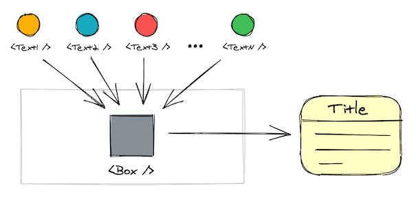

<p>
  
</p>

A dumb component renders any text passed while its visual appearance remains static. It is also unknown how many new content variations are about to come. What would be a useful React pattern in this scenario?

## The Problem
Look at the right side of the picture below.

<p>
  
</p>

It displays two lines of text and a link. You will face no issues representing it with a single component until content becomes dynamic and **texts/link need to change**. In such case **presentation (aka design) is the same**, but content may have **fluid variations**.

>The challenge is how to organize your code, so it remains simple and allows for painless future changes.

To solve it there are three things to take care of: styling, data and business logic.

## The Solution
It aims for _flexibility_ and _maintainability_. Making future changes should be straightforward as that is the real pain point here — prepare the code for [hidden information causing new uses cases](/the-emerging-ship#incomplete-requirements) to pop in.

### Folder Structure

```python{10,11}
-- components
   |-- Box
       |-- Box.js
       |-- Box.css
       |-- components
           |-- Text1.js
           |-- Text2.js
           |-- Text3.js
           |-- Text4.js

```
The solution involves two component levels — parent component (`<Box />`) and several child components for each text case (`<TextN />`). Note that child component names above are chosen to simplify the picture. Ideally you should name them after each specific use case, fx. `StorageEmptyText.js`, `StorageAboveAverageText.js`, `StorageFullText.js`, etc.

### Box Component
That's the parent (container) component. Its purpose is to manage business logic and styling.

```jsx{13,14,18,19,34}
// Box.js

import StorageEmptyText from "./components/StorageEmptyText";
import StorageAboveAverageText from "./components/StorageAboveAverageText";
import StorageFullText from "./components/StorageFullText";

export function Box({
  storage,
  openDialogAction,
  manageStorageAction,
  upgradeToProPlanAction
}) {
  let TextComponent = () => null;
  let handleClick = () => null;

  // 1️⃣ Use case logic: conditionally assign text component and click action
  if (storage === 0) {
    TextComponent = StorageEmptyText;
    handleClick = openDialogAction;

  } else if (storage > 50 && storage < 80) {
    TextComponent = StorageAboveAverageText;
    handleClick = manageStorageAction;

  } else if (storage >= 90) {
    TextComponent = StorageFullText;
    handleClick = upgradeToProPlanAction;
  }
  // 2️⃣ More cases to follow

  return (
    <div className="Box">
      {/* 3️⃣ A component with render prop is famous for its flexibility */}
      <TextComponent>
        {({ title, description, link }) => (
          <>
            {/* 4️⃣ Box.js (the parent) holds these elements' styling */}
            <h3>{title}</h3>
            <p>{description}</p>
            <span onClick={handleClick}>{link}</span>
          </>
        )}
      </TextComponent>
    </div>
  );
}
```

Several benefits emerge from such a structure:
  1. The markup around each text is part of `Box.js` so you can style it here.
  2. The use case logic is explicit.
  3. Child components are nearby.

Having texts encapsulated in `<TextComponent />`s instead of a function or hooks will also lighten the tests. You will need to check the `className` or `data-test-id` presence for each use case, not the actual texts.

```jsx{7}
// Box.test.js

expect(
  <Box storage={95} />,
  "when mounted",
  "to contain elements matching",
  ".StorageFullText"
);
```

### Text Components
You may have any number of these components. They share exactly the same structure — dumb component with a [render prop function](https://reactjs.org/docs/render-props.html#gatsby-focus-wrapper) to accept the texts. File names should be descriptive as that gives you a hint what's going on by both, looking at the folder structure and maintaining the logic in `Box.js`

```jsx{10}
// StorageFullText.js

export default function StorageFullText({ children }) {
  return (
    <div className="StorageFullText">
      {/*
        Passes down its texts to a children() function
        That allows for custom styling in the parent
      */}
      {children({
        title: "Looks like you have too many items",
        description: "Upgrade to our Pro plan or free up more space in your box.",
        link: "See all plans"
      })}
    </div>
  );
}
```

`<StorageFullText />` uses render prop to send back data and is not aware how are texts consumed later on. One of the reasons for using this pattern is the [flexibility render prop components provide over hooks](/render-props-vs-hooks/#re-render-only-what-is-relevant) fx.

## Final Words
Handling text components may look simple on the surface, but in some situations requires you to take different approach and take an extra step.

If a component doesn't change its visual representation and structure, but may have many content variants, it make sense to involve less wrappers if possible. The guiding principle is not to be clever about code reusability. Instead go **explicit and minimal** expecting things to change.
