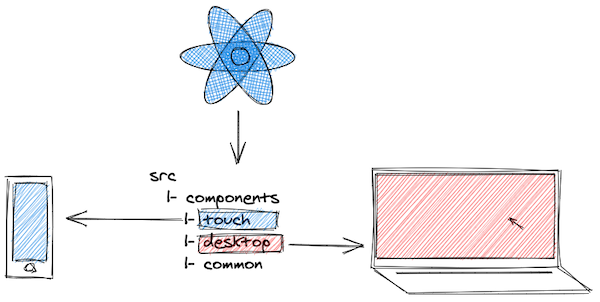

<p>
  
</p>

This article is a mix of arguments, reality checks and a code solution at the end. Often the road leading to an actual implementation is long and bumpy - priorities, design, budget, colleagues with own views, talking in different languages. These obstacles are challenging and usually take more energy to deal with than just coding. For that reason they deserve a separate preface.

Jump to the [code section](#conditionally-import-and-render-components), if this is what you are looking for, otherwise let's continue.
___

## Reality check
**Many companies prefer to build their web apps/sites targeting both touch and desktop devices, but would rather not invest in a separate mobile app.**

Chiefs may not admit it, but the reasons spin around:
 1. building for the browser is fast and cheap
 2. no need to involve backend
 3. prizing "mobile first", but don't really align with that principle
 4. technical impediments to deliver a mobile app to the store
 5. no budget

Working in the browser is fast and reliable. There are many static site generators ([Gatsby](https://www.gatsbyjs.org/), [Nextjs](https://nextjs.org/), [Docusaurus](https://v2.docusaurus.io/)) to support website creation with no backend knowledge required. [Jamstack](https://jamstack.org/what-is-jamstack/) principles and tools make it easier than ever to deliver a product to production. Such tools are capable to bring "mobile first" concept to life, though it still remains wishful thinking.

In the same time publishing a standalone mobile app to some app stores may turn into a nightmare. Read about [the Hey saga](https://hey.com/apple/) fx. In contrast, javascript devs can quickly mockup a touch version with the help of Chrome tools, so why hiring an iOS/Android guy?

All valid points so far and often you as a frontend professional won't get the chance to influence the final decision (especially in big companies). It is to be taken by product, marketing or finance teams.

Native app or web app... Let's say a decision is taken and you are left with no choice - a web app must be delivered (for desktop and mobile users).

## So, if you must do the split
Splitting react apps touch/desktop wise can be tricky if you have to do it in the frontend.

Things to be considered:

 - 1️⃣ figure out the threshold (**when** to serve each app)
 - 2️⃣ decide on the starting point (**where** in the code)
 - 3️⃣ import only app specific components (**how** it should work)

**An answer to these three questions is important since maintainability, time, team motivation and other aspects very much depend on it.**

## When user is considered mobile 1️⃣
Usually you modify component's css to account for mobile devices. Perhaps this

```css{8}
.TopBar {
  height: 60px;
  background-color: #fff;
  ...
}

/* Mobile */
@media (max-width: 768px) {
  .TopBar {
    height: 100px;
    background-color: #ccc;
    ...
  }
}
```

works well most of the time. Same component with different appearance based on browser's width. There is no problem with such an approach and very often it will be enough. Now one may argue that `max-width: 768px` is sufficient to properly tell if user is on a mobile device. Probably not. May be something like that is more accurate:

```css
@media (pointer: coarse) and (hover: none) {
  ...
}
```
You can read more about [interaction media features and their potential](https://css-tricks.com/interaction-media-features-and-their-potential-for-incorrect-assumptions/) to determine device capabilities. It is something to consider when deciding on the criteria to serve the mobile version.
___

Challenges arise when your company starts getting more serious about mobile users ("mobile first"). This could happen due to a separate strong design/UX and product teams being formed. **In this reality your desktop and mobile web apps may end up drastically different. Business logic, pages, interactions and overall appearance are now unalike. Two independent versions of the same software.**

How that translates in React's language?

For sure you won't be able to reuse every single component in both apps (touch and desktop). Same components/pages will require different data set and behave non-identically (javascript logic). Others will be completely unique per app. **In that case css adjustments as the one above may no longer be sufficient.** Interactions and data (javascript) need to be considered along with styling (css).

**This is where a proper split in the frontend must be done and it can't reside in your `.css` files.**

## Where to start the split 2️⃣
It really depends. You have few options consider requirements and design. **One** is to split the app in its root. May be you have `PageRouter.js` or just `App.js` where page components are rendered based on URL path. **Second option** - split individual components. It is a good choice if pages for mobile and desktop are the same (or very similar), but some child components differ. You can also pick the **third option** of using media queries in the css.

Let's focus on the first two choices as they require you to consider javascript.

### Split in the app's root
**This approach makes sense if your mobile and desktop apps are very different - separate pages, behavior, data and business logic in components.**

Let's say there is a product details page (`<ProductDetails />`) on touch which doesn't exist in your desktop site. It displays detailed product information that otherwise would be part of `<Products />` when viewing on PC. On a phone, though, it might be too "noisy" to present so much data in a single page.

```python{3,6}
-- src
   |-- components
   |-- pages
   |   |-- touch
   |   |   |-- Products.js
   |   |   |-- ProductDetails.js
   |   |-- desktop
   |   |   |-- Products.js
   |   |-- common
   |       |-- Checkout.js
   |-- App.js
```
<p align="center">
<sup>See a <a target="_blank" href="https://codesandbox.io/s/desktopmobile-code-split-sjbt0?file=/src/pages/touch/ProductDetails.js">working example</a> in Codesandbox.</sup>
</p>

**Why is this structure OK?**
 - More control

You can look at `/touch` and `/desktop` folders as two separate apps, allowing for full control over their content.

 - Easier maintenance

Most pages in your app will be common - same names component-wise, but implementing app specific logic, which is great for maintenance.

 - Bug fixing in isolation

Having a bug in the products page on touch tells you that the cause is probably in `touch/Products.js`. Fixing it there ensures your desktop page won't be affected.

 - Less side effects

Few more buttons for mobile or a dropdown on desktop? You can feel more comfortable implementing feature requests like that next time.

 - Adequate team collaboration

Implementing a products page means you have to do it for each app (two components). With the folder split above, it's easy to divide the work within the team without stepping on each other's toes.

### Split on component level
Root level code split is often supplemented by splitting the `/components` folder in a similar way. On the other hand, sometimes your desktop and mobile apps won't be very different. Only a few components deep in the tree may have unalike data model or behavior. **If you find yourself in any of the these cases it might be useful to do a split per component**.

```python{2,3,6,9}
-- src
   |-- components
   |   |-- touch
   |   |   |-- TopBar.js
   |   |   |-- TopBar.css
   |   |-- desktop
   |   |   |-- TopBar.js
   |   |   |-- TopBar.css
   |   |-- common
   |       |-- Footer.js
   |       |-- Footer.css
   |-- pages
   |-- App.js
```

`<TopBar />` component has some data/behavior differences that require you to implement it separately for each app. In the same time `/common` folder still contains all shared components.

See how that is done for `/components` with the [products page example](https://codesandbox.io/s/desktopmobile-code-split-sjbt0?file=/src/components/touch/Product.js).

**Why is this structure OK?**

Adding to the pros of the previous section **you will have less code to maintain**, since only a few components may require split. Reusing app specific and shared components is also going to be easy and safe.

```javascript{1}
import ProductDescription from "../../components/desktop/ProductDescription";

export default function Products() {
  ...
}
```
<p align="center">
<sup><code class="language-text">pages/desktop/Products</code> imports only components from <code class="language-text">components/desktop</code>.</sup>
</p>

Enough on the possibilities for organizing the codebase. Once you are done with that, comes the question of how to glue things together.

## Load components on demand 3️⃣
No matter where the split resides in - application root or individual components, or perhaps both -  implementation is going to be the same. After all the pages from the earlier example are also components.

Ideally you want to load only desktop **OR** touch related code in the browser. Loading the whole bundle (all components), but using (rendering) only device specific slice may work, but it's not optimal. A proper implementation requires you to use [dynamic import()](https://developer.mozilla.org/en-US/docs/Web/JavaScript/Reference/Statements/import#Dynamic_Imports).

React docs explain that [React Suspense](https://reactjs.org/docs/react-api.html#reactsuspense) relies on that principle underneath and will probably do the job. You could also base your solution on [loadable-components](https://github.com/gregberge/loadable-components) library. For the sake of simplicity and to cover the specific use case of touch/desktop based split, let's further focus on a plain solution.

### Conditionally import and render components
I personally imagine the following in the application root:

```jsx{8,9,11}
import Import from "./Import";

function App() {
  return (
    <div className="App">
      <h1>Product page</h1>
      <Import
        touch={() => import("./touch/Products")}
        desktop={() => import("./desktop/Products")}
      >
        {Product => <Product />}
      </Import>
    </div>
  )
}
```

The `<Import />` component (you can name it differently) accepts two props - `desktop` and `touch`. They expect a function returning dynamic import call. In the example above there are two independent `<Product />` page components that you may want to import/render conditionally.

The third prop is `children` function that does the actual rendering. An obvious benefit of using render prop function here is the opportunity it gives to explicitly pass any props to your component if needed.

```jsx
{Product =>
  <Product
    title={product.title}
    description={product.description}
  />
}
```

### Implementation details
What will `Import` do internally is to: evaluate which component to load and pass it down as an argument to the render prop function.

Basic implementation may look like:

```javascript
// Detect touch enabled device based on interaction media features
// Not supported in IE11, in which case isMobile will be 'false'
const isMobile =
  window.matchMedia("(pointer: coarse) and (hover: none)").matches;

export function Import({ touch, desktop, children }) {
  const [Component, setComponent] = useState(null);

  useEffect(() => {
    // Assign a callback with an import() call
    const importCallback = isMobile ? touch : desktop;

    // Executes the `import()` call that returns a promise with
    // component details passed as an argument
    importCallback().then(componentDetails => {
      // Set the import data in the local state
      setComponent(componentDetails);
    });
  }, [desktop, touch]);

  // The actual component is assigned to the 'default' prop
  return children(Component ? Component.default : () => null);
}
```
<p align="center">
<sup>See Import and its usage in <a title="Import component" href="https://codesandbox.io/s/desktopmobile-code-split-sjbt0?file=/src/Import.js">the app context</a>.</sup>
</p>

**Some notes:**
 1. `window.matchMedia("(pointer: coarse) and (hover: none)")` - you can use any other mechanism for detecting touch capabilities here. Going one step further, `isMobile` may come from the store instead (if you are using redux, mobx or other global state management mechanism).

 2. `importCallback().then(componentDetails)` - the actual component is set in `componentDetails.default` and you have to export it using default export (`export default function Products()`).

 3. Finally, imported data is set to the local state and your component passed down to the children function that renders it.

Using `import()` requires some prerequisites to allow for proper parsing and dividing the final bundle in parts. You may need to additionally set these up.

### Webpack config
For the split to work there are some [adjustments in the webpack config](https://webpack.js.org/guides/code-splitting/) file to be made. An example config by [Dan Abramov](overreacted.io) can be [found on github](https://gist.github.com/gaearon/ca6e803f5c604d37468b0091d9959269). If you are using **Create React App** that tweak is done by default.

```javascript
module.exports = {
  entry: {
    main: './src/App.js',
  },
  output: {
    filename: "bundle.js",
    chunkFilename: "chunk.[id].js",
    path: './dist',
    publicPath: 'dist/'
  }
};
```

### Babel plugin
[@babel/plugin-syntax-dynamic-import](https://classic.yarnpkg.com/en/package/@babel/plugin-syntax-dynamic-import) plugin is required if you are using Babel in order to parse dynamic imports.

### Eslint config
[eslint-plugin-import](https://www.npmjs.com/package/eslint-plugin-import) is also required to support export/import syntax. Don't forget to update your eslint config file:

```javascript
{
  parser: "babel-eslint",
  plugins: ["import"]
  ...
}
```

Again code splitting is supported by default with [Create React App](https://create-react-app.dev/docs/code-splitting), so if your app is based on it, skip the config steps. If you still feel hesitant [React's docs site](https://reactjs.org/docs/code-splitting.html#import) is a good starting point if you want to get into the code splitting challenge. The focus in there isn't on mobile/desktop separation, but more about the core principle behind lazy component loading.

## Final words
[Check the full solution in CodeSandbox](https://codesandbox.io/s/desktopmobile-code-split-sjbt0?file=/src/App.js) if this is what you are looking for.

I would like to wrap up by sharing my own motivation for having app structure like this one. It may not be your case, but my observations show very common mindset especially in big corps where a clear separation between product, backend and frontend is in place. In that reality it's much easier (and often the only thing you can do) to overcome process issues with a tech solution instead of trying to change people. Here is an example: you know that backend will deliver the API in a week, but you also know that you can deliver the UI today. So waiting one week for the backend? The tech solution to something that might be an organizational problem is to mock the payload and deliver to QA and Product teams early.

Similarly, frontend app split will allow for:
 - **development speed** as per less backend deps
 - **flexibility** when more changes are requested

**It also means less headache by avoid confronting colleagues and management and higher confidence as you remain in your comfortable area of expertise.**

✉️ [Subscribe](https://webup.org/blog/subscribe/) to get more useful content delivered to your email.

## Resources
  - [Code-Splitting - React](https://reactjs.org/docs/code-splitting.html) - from React's official docs.
  - [Code Splitting - Create React App](https://create-react-app.dev/docs/code-splitting/) - words on code splitting in create-react-app.
  - [Suspense for Data Fetching](https://reactjs.org/docs/concurrent-mode-suspense.html) - get an overview on how and when to use React Suspense.
  - [Webpack Code Splitting](https://webpack.js.org/guides/code-splitting/) - configure webpack to support code split in your React app.
  - [Loadable Components - Guide](https://loadable-components.com/docs/getting-started/) - Getting started guide for [loadable-components](https://github.com/gregberge/loadable-components).
  - [Interaction Media Features and Their Potential](https://css-tricks.com/interaction-media-features-and-their-potential-for-incorrect-assumptions/) - how to better determine device capabilities with media queries.
