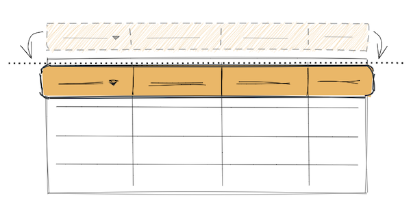
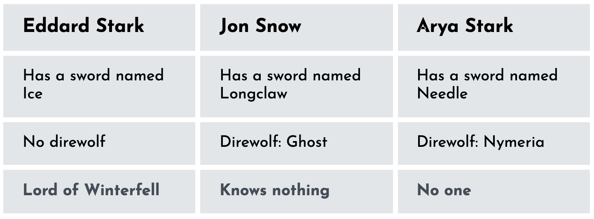
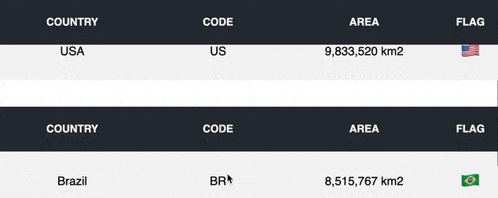

<p>
  
</p>

**Using the `<table />` element instead of flexbox for data presentation is a good thing. How to turn the table header sticky with the help of React in that case? How to use it then in production code?** This blog post is all about that.

What follows is not a trivial tutorial on how you should solve the task. It is not a theory or fictional implementation, either. Instead, the focus is around a possible solution tested in real projects that you can easily reuse. It also sorts out some of the edge cases when working with `<table />`.

**Go straight to the [code](#sticky-header-code-solution), if that's mostly what your are looking for.**

### Table of Contents:

1. [Tables vs Flexbox](#tables-vs-flexbox)
    - [Control Columns via Header Cells](#control-columns-via-header-cells)
    - [Header and Content Component Split](#header-and-content-component-split)
    - [Tables Work Out of the Box](#tables-work-out-of-the-box)

2. [Sticky Header (code solution)](#sticky-header-code-solution)
    - [\<Table \/\> Component Interface](#table--component-interface)
    - [\<Table \/\> Component Implementation](#table--component-implementation)
    - [useStickyHeader() Implementation](#usestickyheader-implementation)
3. [Final Words](#final-words)
4. [Resources](#resources)
___

## Tables vs Flexbox
Whenever you have to deal with data presentation, often the first intention is to create a `<div />` based layout with flexbox. People are somehow biased to tables. Tables have a bad reputation of being used for building web pages in the past. **But if done right, they can save you a ton of problems. Tables do also play very well with React.**

**On the other side, it doesn't come very handy to loop over your data and place it in a flexbox based grid.** A good illustration on the problem is described in [Accessible, Simple, Responsive Tables](https://css-tricks.com/accessible-simple-responsive-tables/#1b-for-column-oriented-tables).

<p>

</p>
<p align="center">
<sup>Table layout with flexbox. The screenshot is taken from <a target="_blank" href="https://codepen.io/moubi/pen/WNxVdxY">here</a>.<sup>
</p>

The table-like layout above is styled with flex and looks very similar to:

```html{2,7}
<div class="table">
  <h3 class="header">Eddard Stark</h3>
  <div class="row">Has a sword named Ice</div>
  <div class="row">No direwolf</div>
  <div class="row">Lord of Winterfell</div>

  <h3 class="header">Jon Snow</h3>
  <div class="row">Has a sword named Longclaw</div>
  <div class="row">Direwolf: Ghost</div>
  <div class="row">Knows nothing</div>

  ...
</div>
```

A question arises: How ergonomic is to iterate over the headers and rows data with the given markup?

**Contrary, some of the table benefits include:**
  1. Column width control via header cells
  2. Painless component-wise split between header and content (table rows)
  3. Works out of the box (no CSS)

All these play a role in the challenges behind turning table headers (`<thead />`) into sticky items. Understanding them, should help you better follow the code solution after.
___

You can build table layouts by using the usual `<table />` tag or achieve the same via CSS with `display: table` and semantic elements (`<div />`).

```jsx{3,9}
// This
<table>
  <thead />
  ...
</table>

// is the same as
<div style={{ display: "table" }}>
  <div style={{ display: "table-header-group" }} />
  ...
</div>
```

Same visual result. The first one, though, will cause React to complain (also in tests) if you place `<thead />` outside its `<table />` parent.

```jsx{1}
<div>
  <thead />
</div>
```

```diff
- Warning: validateDOMNesting(...): <thead> cannot appear as a child of <div>.
```

For the sake of simplicity and to be more explicit, all examples from now on are based on the `<table />` element.

Back on the benefits.

### Control Columns via Header Cells
It may appear counterintuitive since the header and body cells are placed far from each other in the DOM.

```html{4,9}
<table>
  <thead>
    <tr>
      <th style="width: 200px;">Header cell</th>
    </tr>
  </thead>
  <tbody>
    <tr>
      <td>Table cell 1</td>
    </tr>
    <tr>
      <td>Table cell 2</td>
    </tr>
  </tbody>
</table>
```

In this example the width of all `<td />` elements will be the same as the width set with `<th style="width: 200px;">Header cell</th>`.

**You get a side effect that allows for easy control over columns size with no additional cost of setting extensive CSS rules.**

### Header and Content Component Split
Apart from column sizing, sorting and filtering are mostly attached to the headers too. It turns out headers are very powerful unit for ruling the whole table. Such a connection pops in useful whenever you need to split the table into more React components.

Given this Table component interface (ignore details):

```jsx
  <Table sortable headers={["Country", "Population"]} data={data}>
    {dataAfterSorting => (
      dataAfterSorting.map(country =>
        <TableDataRow data={country} />
      )
    )}
  </Table>
```

[its structure comes natural](https://reactjs.org/docs/fragments.html#motivation) because:

 1. It follows how tables render in the DOM (_with separate header and body sections_).

 2. Sorting functionality is attached to the header.

Headers set their own styles. That includes sorting indicators, hover states and behavior (click handlers).

 3. The content is not aware of its context.

`<TableDataRow />` may live outside the table. It accepts a slice of a pre-sorted data and simply renders a row with its own styling. **This component is not aware of its context and doesn't need to. With one exception: the number of cells (`<td />`) it displays must be the same as in the header.**

### Tables Work Out of the Box
[Tables are straightforward and well known](https://css-tricks.com/complete-guide-table-element/). You don't need additional code to achieve a basic presentation for a given data set. By simply using the `<table />` structure you already have a form for the numbers.

The same is not true for **flexbox** as discussed earlier.

## Sticky Header (code solution)


This is the demo implementation and its code can be found in the [CodeSandbox project](https://codesandbox.io/s/sticky-header-table-with-react-3j5zy?file=/src/Table.js). The stickiness is achieved by a simple `<Table />` component and a `useStickyHeader` React hook.

**Reuse it by adding your own table styles in [styles.css](https://codesandbox.io/s/sticky-header-table-with-react-3j5zy?file=/src/styles.css).**

### `<Table />` Component Interface
The Table component itself can be used like so

```jsx{14}
// App.js
const tableHeaders = ["Country", "Code", "Area", "Flag"];

export const tableData = [
  {
    country: "Brazil",
    code: "BR",
    area: "8,515,767 km2",
    flag: "🇧🇷"
  },
  ...
];

<Table headers={tableHeaders} data={tableData} />
```
<p align="center">
<sup>See <a target="_blank" href="https://codesandbox.io/s/sticky-header-table-with-react-3j5zy?file=/src/App.js">App.js</a><sup>
</p>

where its `headers` prop accepts an array of strings and `data` is an array of objects.

`<Table />`'s interface is not so crucial for the actual sticky  implementation and you can build your own abstraction.

### `<Table />` Component Implementation
Below is the code behind `Table.js`. It serves as a wrapper for the table and its sticky header.

```jsx
// Table.js
function Table({ headers = [], data = [] }) {
  const { tableRef, isSticky } = useStickyHeader();

  const renderHeader = () => (
    <thead>
      <tr>
        {headers.map(item => <th key={item}>{item}</th>)}
      </tr>
    </thead>
  );

  return (
    <div>
      {isSticky && (
        <table
          className="sticky"
          style={{
            position: "fixed",
            top: 0,
            left: 0,
            right: 0
          }}
        >
          {renderHeader()}
        </table>
      )}
      <table ref={tableRef}>
        {renderHeader()}
        <tbody>
          {data.map(item => (
            <tr key={item.code}>
              <td>{item.country}</td>
              <td>{item.code}</td>
              <td>{item.area}</td>
              <td>{item.flag}</td>
            </tr>
          ))}
        </tbody>
      </table>
    </div>
  );
}
```
<p align="center">
<sup>View <code>Table.js</code> in <a target="_blank" href="https://codesandbox.io/s/sticky-header-table-with-react-3j5zy?file=/src/Table.js">CodeSandbox</a>.<sup>
</p>

A few important moments need a bit of details here.

```javascript
const { tableRef, isSticky } = useStickyHeader();
```

The [custom React hook](https://reactjs.org/docs/hooks-custom.html) with two props exposed:
 - `tableRef` - used to ref the table element you want to have a sticky header for.
 - `isSticky` - a flag turning `true` whenever the table is over the page's top edge.

```jsx{16}
// Render if isSticky is true.
{isSticky && (
  // This is a required <table /> wrapper for the sticky header.
  // .sticky class distinguishes from the original table
  // and the additional style enables the stickiness.
  <table
    className="sticky"
    style={{
      position: "fixed",
      top: 0,
      left: 0,
      right: 0
    }}
  >
    {/* Render the same table header */}
    {renderHeader()}
  </table>
)}
```

That part renders a sticky header if `isSticky` is true.

The sticky element above should inherit the original `<table />`'s styling in order to achieve the same appearance.

Another thing to note - there are two calls of `renderHeader()`. It means two `<thead />`s in the markup if stickiness is on. **This is required. The original header needs to fill the physical space on top of the table. And it can't go sticky since `position: fixed` takes elements [out of their context](https://developer.mozilla.org/en-US/docs/Web/CSS/position#Syntax). In this case introducing a second copy of the header is one way to address the issue.**

### `useStickyHeader()` Implementation
The `useStickyHeader` hook is probably the only piece of code you would need.

```javascript
// useStickyHeader.js
const useStickyHeader = (defaultSticky = false) => {
  const [isSticky, setIsSticky] = useState(defaultSticky);
  const tableRef = useRef(null);

  const handleScroll = useCallback(({ top, bottom }) => {
    if (top <= 0 && bottom > 2 * 68) {
      !isSticky && setIsSticky(true);
    } else {
      isSticky && setIsSticky(false);
    }
  }, [isSticky]);

  useEffect(() => {
    const handleScroll = () => {
      handleScroll(tableRef.current.getBoundingClientRect());
    };
    window.addEventListener("scroll", handleScroll);

    return () => {
      window.removeEventListener("scroll", handleScroll);
    };
  }, [handleScroll]);

  return { tableRef, isSticky };
};
```
<p align="center">
<sup>View <code>useStickyHeader.js</code> in <a target="_blank" href="https://codesandbox.io/s/sticky-header-table-with-react-3j5zy?file=/src/useStickyHeader.js">CodeSandbox</a>.<sup>
</p>

Quickly going through the code chunk by chunk.

```javascript
const [isSticky, setIsSticky] = useState(defaultSticky);
const tableRef = useRef(null);
```

`useState` provides a way to update the `isSticky` flag based on some calculations. It takes a default value passed by the parent (the page may load with the table in the middle). `tableRef` is simply a ref to the table element required for some calculations later on.

```javascript{4}
const handleScroll = useCallback(({ top, bottom }) => {
  // The number 68 is hardcoded here and is the header's height.
  // It could also be skipped
  if (top <= 0 && bottom > 2 * 68) {
    !isSticky && setIsSticky(true);
  } else {
    isSticky && setIsSticky(false);
  }
  // returns a new memoized callback
  // whenever the value of isSticky changes
}, [isSticky]);
```

And here follow the necessary calculations. `{ top, bottom }` describes the table's position on the screen. Once it starts passing off (`top <= 0`) or there is a visual space for at least two headers (`bottom > 2 * 68`)—the sticky mode is enabled.

<p>
  
</p>

The second part of the hook's implementation is its side effect. It does the scroll event binding and passes the current table dimensions down to the evaluation callback.

```javascript{4,6}
useEffect(() => {
  const handleScroll = () => {
    // Pass the current bounding rect of the table
    handleScroll(tableRef.current.getBoundingClientRect());
  };
  window.addEventListener("scroll", handleScroll);

  // Clear the effect
  return () => {
    window.removeEventListener("scroll", handleScroll);
  };
  // Recreate the effect if handleScroll is a new function
}, [handleScroll]);
```

## Final Words
The full solution lives [here](https://codesandbox.io/s/sticky-header-table-with-react-3j5zy?file=/src/App.js).

Turning a table header sticky could be challenging in contrast to something made out of flexbox. It is frustrating to see that simply applying `position: fixed` to the header doesn't magically work. And perhaps having to render two `<thead />`s is too much.

**On the other hand tables come very handy at presenting array-like data with many default benefits.** It is the reason for this separate blog post dedicated to the header challenge with a custom React hook being the main bolt.

## Resources
  - [A Complete Guide to the Table Element](https://css-tricks.com/complete-guide-table-element/) - deep into tables by Chris Coyier.
  - [Accessible, Simple, Responsive Tables](https://css-tricks.com/accessible-simple-responsive-tables/) - approaching table layouts with flexbox.
  - [Fragments](https://reactjs.org/docs/fragments.html) - React docs on Fragments with table splitting examples.
  - [Building Your Own Hooks](https://reactjs.org/docs/hooks-custom.html) - the official guide behind custom hook extraction.
  - [CSS: Cascading Style Sheets - position](https://developer.mozilla.org/en-US/docs/Web/CSS/position#Syntax) - more about `position: fixed` on MDN.
  - [Render Props vs React Hooks](https://webup.org/blog/render-props-vs-hooks/) - pattern comparison to help when deciding on component interfaces.

Thanks for reading.

