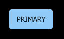

You want to write React unit (component) tests in a human-readable manner. In conjunction with the best practices today it should make your life (and the life of your colleague developers) easier and reduce the number of production bugs.

```jsx
it("should render a button with text", () => {
  expect(
    <Button>I am a button</Button>,
    "when mounted",
    "to have text",
    "I am a button"
  );
});
```

This component test is for real. Back on it soon... [🔖]

## The Problem
Snapshots and direct DOM comparison are **fragile** while JQuery like chaining syntax **reads bad** and makes tests wordy. **How to address the readability issue in that case? How to keep up [testing components' data flow in isolation](https://testing-library.com/docs/dom-testing-library/intro#the-problem) by hiding their implementation details**?

**Below is my approach to unit testing in React.** It aims to follow the consensus with a pinch of clarity on top.

## The Component (A Button)
A trivial [Material UI-like button](https://material-ui.com/components/buttons/) will be used for this demonstration. It is simple enough to unfold the concept with the help of several test examples.


<details open>
<summary>Button.js</summary>

```jsx
// Button.js

export default function Button({
  children,
  disabled = false,
  color,
  size,
  onClick,
}) {
  const handleClick = () => {
    if (!disabled) {
      if (typeof onClick === "function") {
        onClick();
      }
    }
  };

  return (
    <button
      className={classNames("Button", {
        [color]: color,
        [size]: size,
      })}
      disabled={disabled}
      onClick={handleClick}
    >
      {children}
    </button>
  );
}
```

</details>

## Testing Library
Getting back to the test case on top [🔖]. It uses [UnexpectedJS](https://unexpected.js.org/)—an assertion library compatible with all test frameworks—supplemented by a few plugins to help you working with React components and the DOM.

**Jest** is the test runner and behind the scenes, it has `react-dom` and [react-dom/test-utils](https://reactjs.org/docs/test-utils.html) as dependencies.

### Testing Setup
There is an [example GitHub repo](https://github.com/moubi/react-button) you can use as a ref. Head over there for the full picture.

Otherwise here are some of the more interesting moments:


#### Project Structure

```python{6,8}
-- src
    |-- components
    |   |-- Button
    |   |   |-- Button.js
    |   |   |-- Button.scss
    |   |   |-- Button.test.js
    |-- test-utils
    |   |-- unexpected-react.js

```

#### Test Plugins

`package.json`

```diff
"devDependencies": {
  ...
+ "sinon": "9.2.4",
+ "unexpected": "12.0.0",
+ "unexpected-dom": "5.0.0",
+ "unexpected-reaction": "3.0.0",
+ "unexpected-sinon": "11.0.1"
}
```

`Sinon` is used for spying on functions—callback component props executed as a result of specific user interactions with the UI.


#### Test Helper
A test helper named `unexpected-react.js` has the following structure:

```javascript
// unexpected-react.js

import unexpected from "unexpected";
import unexpectedDom from "unexpected-dom";
import unexpectedReaction from "unexpected-reaction";
import unexpectedSinon from "unexpected-sinon";

const expect = unexpected
  .clone()
  .use(unexpectedDom)
  .use(unexpectedReaction)
  .use(unexpectedSinon);

export { simulate, mount } from "react-dom-testing";

export default expect;
```

It simply exports all necessary functions to put together the Button's tests.

### Button Component Tests

```javascript
// Button.test.js

import expect, { mount, simulate } from "../../test-utils/unexpected-react";
import React from "react";
import sinon from "sinon";

import Button from "./Button";

describe("Button", () => {
  // Test cases
});
```

Individual unit/component tests are placed within a `describe()` block. See below.

#### 1. Render with text.


```jsx
it("should render with text", () => {
  expect(
    <Button>I am a button</Button>,
    "when mounted",
    "to have text",
    "I am a button"
  );
});
```

Checking if a button renders with the specified text.

#### 2. Render with custom markup.


```jsx
it("should render with markup", () => {
  expect(
    <Button>
      <span>Download</span>
      <span>⬇️</span>
    </Button>,
    "when mounted",
    "to satisfy",
    <button>
      <span>Download</span>
      <span>⬇️</span>
    </button>
  );
});
```

If you want to **compare the DOM structure**—which in this case may make sense—this is the way to go.

You can also use `data-test-id` with its relevant assertion. Fx.

```jsx
it("should render with markup", () => {
  expect(
    <Button>
      <span>
        <i />
        <span data-test-id="button-text">
          Download
        </span>
      </span>
    </Button>,
    "when mounted",
    "queried for test id"
    "to have text",
    "Download"
  );
});
```

#### 3. Render a primary button.



```jsx
it("should render as primary", () => {
  expect(
    <Button color="primary">Primary</Button>,
    "when mounted",
    "to have class",
    "primary"
  );
});
```

There are two supported `color` prop values: primary and secondary. These are then set as CSS classes.

#### 4. Render a small button.


```jsx
it("should render as small", () => {
  expect(
    <Button size="small">Small</Button>,
    "when mounted",
    "to have class",
    "small"
  );
});
```

Similar to `color` there are two values for the `size` prop: small and large.

#### 5. Render as disabled.


```jsx
it("should render as disabled", () => {
  expect(
    <Button disabled>Disabled</Button>,
    "when mounted",
    "to have attributes",
    {
      disabled: true,
    }
  );
});
```

Checking for the `disabled` attribute. That's all.

#### 6. Don't trigger click handlers.

```jsx
it("should NOT trigger click if disabled", () => {
  const handleClick = sinon.stub();

  const component = mount(
    <Button onClick={handleClick} disabled>Press</Button>
  );

  simulate(component, { type: "click" });

  expect(handleClick, "was not called");
});
```

The `onClick` callback should not be executed on disabled-buttons.

#### 7. Handle a click.

```jsx
it("should trigger click", () => {
  const handleClick = sinon.stub();

  const component = mount(
    <Button onClick={handleClick}>Click here</Button>
  );

  simulate(component, { type: "click" });

  expect(handleClick, "was called");
});
```

The `was called` assertion here has a better alternative if you need to test for arguments passed to the handler. Fx.

```jsx
  // Passing a checkbox state (checked) to the callback
  expect(handleClick, "to have a call satisfying", [true]);
```

#### 8. Tests output.


This is what you will see in the terminal if all unit tests are passing.

## Final Words
There is a trend for testing in React (and testing in general) which has been started by React Testing Library and seems [the majority of our community is going after it](https://www.reddit.com/r/reactjs/comments/lnapvh/the_current_state_of_hoc_hooks_and_render_props/go0yqpp?utm_source=share&utm_medium=web2x&context=3). Its guiding principle is:

>...you want your tests to avoid including implementation details of your components and rather focus on making your tests give you the confidence for which they are intended.

This statement translates to something like _**"you should not test against components' DOM structure but rather focus on data flow."**_ Changes in your component DOM should not break your tests.

UnexpectedJS comply with this principle by allowing you to easily test for `data-test-id` (or `aria-*` attributes) while at the same time encourages writing human-readable unit tests by its custom assertions.
